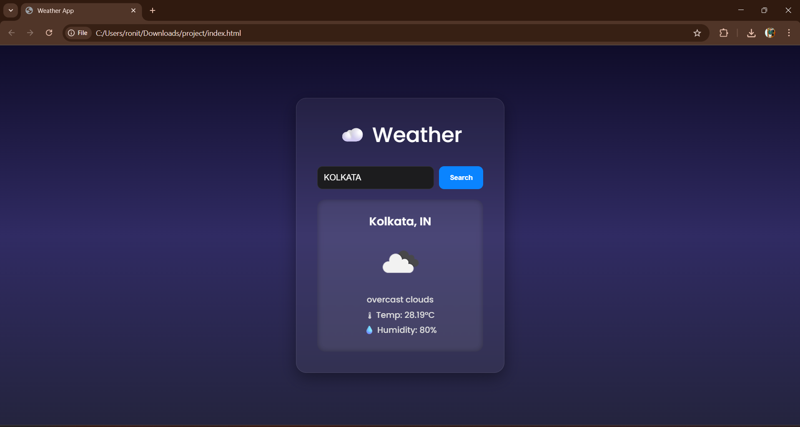

# 🌤️ Dynamic Weather App

An elegant and responsive weather forecast web app built using **HTML**, **CSS**, and **JavaScript**, powered by the **OpenWeatherMap API**. The app not only fetches and displays real-time weather data but also dynamically changes its background and font colors based on the **temperature** and **day/night** status — giving users a rich visual experience.

---

## 🚀 Features

- 🔍 Search weather by city name
- 🌡 Displays:
  - Temperature (°C)
  - Weather condition (e.g., clear sky, rain)
  - Humidity (%)
  - Weather icon
- 🎨 Dynamic background and font color:
  - Changes based on temperature range
  - Adjusts for day/night using icon codes
- 📱 Fully responsive & mobile-friendly design
- 🧊 Apple-style glassmorphism UI

---

## 🛠 Tech Stack

- HTML5
- CSS3 (with gradients, glassmorphism)
- JavaScript (ES6)
- OpenWeatherMap API

---

## 📦 Getting Started

1. **Clone the repository**
   ```bash
   git clone https://github.com/your-username/weather-app.git
   ```

2. **Navigate to the project folder**
   ```bash
   cd weather-app
   ```

3. **Replace the API key**
   - Open `script.js`
   - Replace `YOUR_API_KEY` with your actual [OpenWeatherMap](https://openweathermap.org/) API key

4. **Open `index.html` in your browser**

---

## 🌈 Background Logic

| Time  | Temp (°C)      | Background Theme            |
|-------|----------------|-----------------------------|
| Day   | ≤ 10           | Cool blue gradient          |
| Day   | 11 – 25        | Soft pastel tones           |
| Day   | > 25           | Warm orange/yellow          |
| Night | ≤ 10           | Deep twilight blues         |
| Night | 11 – 25        | Cool navy tones             |
| Night | > 25           | Dark violet gradient        |

---

## 🖼️ Preview

)

---

## 🌐 Live Demo

[Click to View Live Site](https://ronitbera.github.io/WeatherApp/)

---

## 📄 License

This project is licensed under the **MIT License**.  
Feel free to use and modify for personal or educational purposes.

---

> Made with 💙 by Ronit
